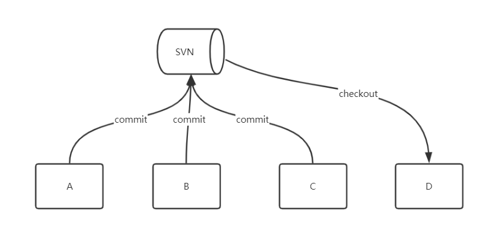
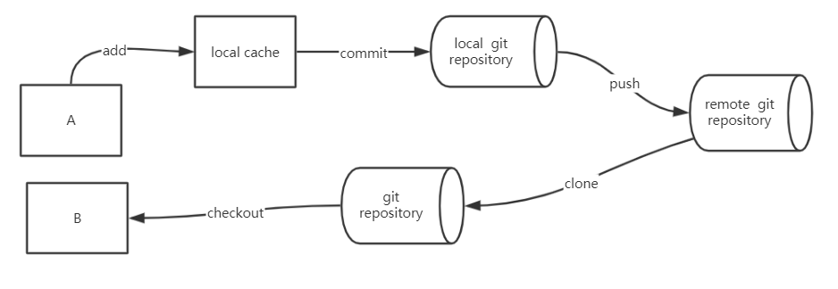
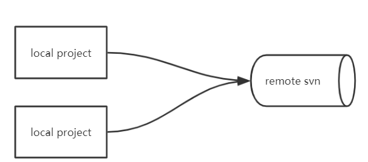
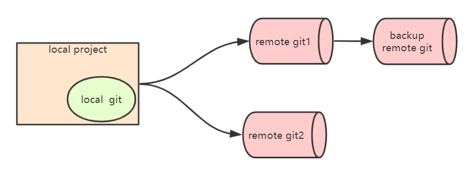
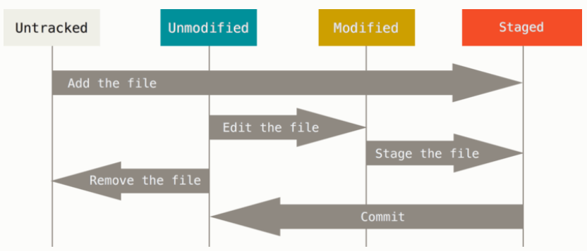
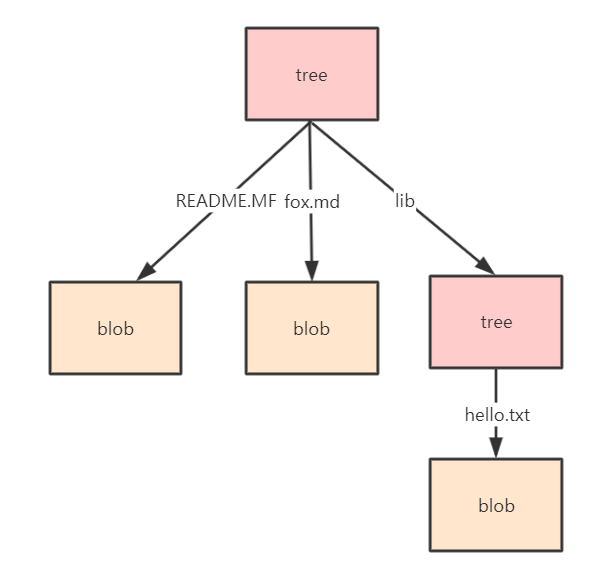

# git实战

- git与svn的区别

- git核心命令使用
- git底层实现原理剖析
- 基于git通信协议搭建git私服
- 基于gogs搭建企业git私服


### git基础概念

git是一个开源的分布式版本控制系统，可以有效、高速地处理从很小到非常大的项目版本管理。git 是 Linus Torvalds为了帮助管理 Linux 内核开发而开发的一个开放源码的版本控制软件。

#### git与svn的区别

- 存储方式不同
- 使用方式不同
- 管理模式不同

##### 存储方式不同

git把内容按**元数据**方式存储,类似k/v数据库，而svn是按文件存储

git存储过程演示

```shell
$ git init fox
Initialized empty git repository in D:/git/fox/.git/
$ cd fox
$ echo 'hello world' >> README.MF

$ git hash-object -w README.MF
warning: LF will be replaced by CRLF in README.MF.
The file will have its original line endings in your working directory.
3b18e512dba79e4c8300dd08aeb37f8e728b8dad

$ git cat-file -p 3b18e512dba79e4c8300dd08aeb37f8e728b8dad
hello world
```

##### 使用方式不同

从本地把文件推送远程服务，svn只需要commint，而git需要 add、commint、push 三个步骤

- svn使用过程



- git使用过程



##### 管理模式不同

git 是一个分布式的版本管理系统，而要svn是一个远程集中式的管理系统

- 集中式



- 分布式



### git核心命令

#### git 客户端安装

官方客户端： [https://git-scm.com/downloads](https://git-scm.com/downloads)

其它客户端：https://tortoisegit.org/download/

文档： https://www.git-scm.com/docs


centos7 安装git

```shell
# yum安装
yum install -y git
```

源码编译安装

```shell
# 1.安装依赖环境
yum -y install curl-devel expat-devel gettext-devel openssl-devel zlib-devel gcc perl-ExtUtils-MakeMaker

# 2.下载并解压源码
$ wget https://github.com/git/git/archive/v2.3.0.zip
$ unzip v2.3.0.zip
$ cd git-2.3.0

#3 编译 安装（如果没有权限就加上sudo）
make prefix=/usr/local/git all
make prefix=/usr/local/git install

#4、添加环境变量
vim /etc/profile
export PATH=/usr/local/git/bin:$PATH
source /etc/profile

#如果成功显示版本号表示添加成功
git --version
git version 2.3.0
```

Git配置

```shell
#Git安装完之后，需做最后一步配置。打开git bash，分别执行以下两句命令
git config --global user.name "username"
git config --global user.email "xxxx@163.com"
#git 自动记住用户和密码操作
git config --global credential.helper store
#查看配置信息
git config -l

cat ~/.gitconfig
```


#### git的基本使用

完整模拟从项目添加到push 过程

- 创建项目

- 初始化git仓库

- 提交文件

- 远程关联

- push 至远程仓库


##### 初始化git仓库

```shell
#基于远程仓库克隆至本地
$ git clone <remote_url>

# 将指定目录初始化为git本地仓库
$ git init <directory>
```

##### 查看仓库状态

```shell
# 查看本地仓库的状态
$ git status
# 以简短模式查看本地仓库的状态
# 会显示两列，第一列是文件的状态，第二列是对应的文件
# 文件状态：A 新增，M 修改，D 删除，?? 未添加到git中
$ git status -s
```

**文件的状态变化周期**

工作目录下的每一个文件都有两种状态：已跟踪或未跟踪。 已跟踪的文件是指那些被纳入了版本控制的文件，在上一次快照中有它们的记录，在工作一段时间后，它们的状态可能处于未修改，已修改或已放入暂存区。 工作目录中除已跟踪文件以外的所有其它文件都属于未跟踪文件，它们既不存在于上次快照的记录中，也没有放入暂存区。 初次克隆某个仓库的时候，工作目录中的所有文件都属于已跟踪文件，并处于未修改状态。



##### 本地添加

```shell
#添加指定文件至暂存区
$ git add <fileName>
# 添加所有修改、已删除的文件到暂存区中
$ git add -u <directory>
#添加所有修改、已删除、新增的文件到暂存区中，省略 <文件路径> 即为当前目录
$ git add -A <directory>

# 当需要删除暂存区或分支上的文件，同时工作区不需要这个文件
$ git rm <directory>
# 当需要删除暂存区或分支上的文件，同时工作区需要这个文件，但是不需要被版本控制
$ git rm --cached <file>

```

##### 本地提交

```shell
# 把暂存区中的文件提交到本地仓库中并添加描述信息
$ git commit <file> -m '提交的描述信息'
# 把所有修改、已删除的文件提交到本地仓库中
# 不包括未被版本库跟踪的文件，等同于先调用了 "git add -u"
$ git commit -am '提交的描述信息'

```

##### 远程仓库管理

```shell
# 列出已经存在的远程仓库
$ git remote
# 列出远程仓库的详细信息，在别名后面列出URL地址
$ git remote -v
#添加远程仓库地址
$ git remote add origin http:xxx.xxx
#删除指定名称的远程仓库origin
$ git remote remove origin 

#把本地仓库的提交推送到远程仓库
#上传新分支至远程
$ git push --set-upstream origin master 
$ git push -u origin master

#将本地分支与远程建立关联
$ git branch --track --set-upstream-to=origin/test test
```

##### 分支管理

```shell
#查看本地分支，当前所在分支以 "*" 标出
$ git branch
#查看所有分支
$ git branch -avv
#基于当前分支创建一个新分支
$ git branch <branch name>
#基于存在的分支创建一个新分支
$ git branch <branch name> <exist branch>
#基于远程分支创建一个新分支
git branch <branch name> origin/master
#基于提交创建一个新分支
$ git branch <branch name> <commit id>
#基于标签创建一个新分支
$ git branch <branch name> <tag name>

#删除分支
$ git branch -d {dev}
#切换分支
$ git checkout <branch name>
#合并分支
$ git merge <merge target>
#解决冲突，如果因冲突导致自动合并失败，此时 status 为mergeing 状态.
#需要手动修改后重新提交（commit） 


#还原提交记录
# 将 HEAD 的指向改变，撤销到指定的提交记录，文件也修改了
$ git reset --hard <commit ID>
```


##### tag管理

```shell
#查看当前
$ git tag
#基于分区创建tag
$ git tag <tag name> <branch name>

# 基于提交创建tag
$ git tag <tag name> [<commit ID>]
# 可以指定标签信息
$ git tag -a <tagname> -m "..."

# 查看标签信息
$ git show <tagname>
# 推送一个标签到远程
$ git push origin <tagname>
# 删除标签
$ git tag -d <tagname>

```


##### 日志管理

```shell
#查看当前分支下所有提交日志
$ git log
#查看当前分支下所有提交日志
$ git log {branch}
# 单行显示日志
$ git log <dev> --oneline
# 比较两个版本的区别
$ git log dev..master

#以图表的方式显示提交合并网络
$ git log --pretty=format:'%h %s' --graph
$ git log --graph --pretty=oneline --abbrev-commit

# 可以查看所有分支的所有操作记录（包括已经被删除的 commit 记录和 reset 的操作）
$ git relog
# 回退
$ git reset --hard <commit ID>
```


### git底层原理

- git存储对象

- git树对象

- git提交对象

- git引用

#### git存储对象

git 是一个内容寻址文件系统，其核心部分是一个简单的键值对数据库（key-value data store），你可以向数据库中插入任意内容，它会返回一个用于取回该值的hash 键。

```shell
# git 键值库中插入数据
$ echo 'hello world version 1.0' | git hash-object -w --stdin
e4dc2ded6eb80dbbe38375acd0b409c81e98277d

#基于键获取指定内容
$ git cat-file -p e4dc2ded6eb80dbbe38375acd0b409c81e98277d
hello world version 1.0

```

git基于该功能 把每个文件的版本中内容都保存在数据库中，当要进行版本回滚的时候就通过其中一个键将其取回并替换。

模拟演示git 版本写入与回滚过程

```shell

# 查找所有的git对象
$ find .git/objects/ -type f
# 写入版本1
$ echo 'hello world version 1.0' > README.MF;git hash-object -w README.MF
warning: LF will be replaced by CRLF in README.MF.
The file will have its original line endings in your working directory.
e4dc2ded6eb80dbbe38375acd0b409c81e98277d

# 写入版本2
$ echo 'hello world version 2.0' > README.MF;git hash-object -w README.MF
warning: LF will be replaced by CRLF in README.MF.
The file will have its original line endings in your working directory.
a984c1ed3f9a3eceaf4043c5a3b227954621b5ea

# 写入版本3
$ echo 'hello world version 3.0' > README.MF;git hash-object -w README.MF
warning: LF will be replaced by CRLF in README.MF.
The file will have its original line endings in your working directory.
14f5521ac31e82f0b51ba2d278c6ce185e4a7a9a

# 回滚指定版本
$ git cat-file -p e4dc2ded6eb80dbbe38375acd0b409c81e98277d > README.MF
```

git add 其实就是把修改之后的内容 插入到键值库中。当执行 git add README.MF 等同于执行了 git hash-object -w README.MF 把文件写到数据库中。


#### git树对象

树对象解决了文件名存储的问题，它的目的是将多个文件名组织在一起，其内包含多个文件名称与其对应的Key和其它树对象的引用，可以理解成操作系统当中的文件夹，一个文件夹包含多个文件和多个其它文件夹。



每一个分支当中都关联了一个树对像，他存储了当前分支下所有的文件名及对应的 key.

通过以下命令即可查看

```shell
# 查看commit对象
$ git cat-file -p 263d8a9463a5be9c8cb6973464fd7408945e20ac
tree 7ca5aba06a1d353f082de003afb6aec2a334bc2a
author fox <2763800211@qq.com> 1575524733 +0800
committer fox <2763800211@qq.com> 1575524733 +0800

commit 1

#查看对象类型
$ git cat-file -t 263d8a9463a5be9c8cb6973464fd7408945e20ac
commit


#查看tree对象
$ git cat-file -p master^{tree}
100644 blob e4dc2ded6eb80dbbe38375acd0b409c81e98277d    README.MF
100644 blob f2f901d721b1819be1b9874952245ed6d2523d1d    fox.md

```


#### git提交对象

一次提交即为当前版本的一个快照，该快照就是通过提交对象保存，其存储的内容为：一个顶级树对象、上一次提交的对象哈希、提交者用户名及邮箱、提交时间戳、提交评论。


```shell
# 查看提交日志
$ git log master
commit c631696a799a04dc04187b01a89854cef285b85e (HEAD -> master)
Author: fox <2763800211@qq.com>
Date:   Thu Dec 5 14:01:21 2019 +0800

    2 commit

commit 263d8a9463a5be9c8cb6973464fd7408945e20ac
Author: fox <2763800211@qq.com>
Date:   Thu Dec 5 13:45:33 2019 +0800

    commit 1

#查看提交对象信息
$ git cat-file -p  c631696a799a04dc04187b01a89854cef285b85e
tree cc0850e551b41927c7aa88e1273bf4cedde9f63e
parent 263d8a9463a5be9c8cb6973464fd7408945e20ac
author fox <2763800211@qq.com> 1575525681 +0800
committer fox <2763800211@qq.com> 1575525681 +0800

2 commit

```


从修改一个文件到提交的过程中会生成三类对象：

一个内容对象 ==> 存储了文件内容

树对象（至少一个） ==> 存储了文件名及内容对象的key 

一个提交对象 ==> 存储了树对象的key 及提交评论。


#### git引用

当执行 git branch {branchName} 时创建了一个分支，其本质就是在git 基于指定提交创建了一个引用文件，保存在 .git\refs\heads\ 下。

```shell
# 创建分支
$ git branch dev 
# 查看分支引用文件
$ cat .git\refs\heads\dev
# 查看分支差异
git diff dev..master
 
```


### git通信协议

分布式通信需要有应用协议，应用协议的实现包含编码，解码和远程传输的实现，git支持四种应用协议，分别是Local，http，git，ssh。通过四种协议都可以手动搭建简单的git仓库私服。


#### Local(本地协议)

本地协议可以基于本地文件系统，或者共享（NFS）文件系统进行访问，来实现源码的一个共享，使用Local协议搭建git私服是最轻松的，也是最简单的。

**优点：**简单，直接使用了现有的文件权限和网络访问权限，小团队小项目建立一个这样的版本管理系统是非常轻松的一件事。

**缺点：**这种协议缺陷就是本身共享文件系统的局限，只能在局域网，而且速度也慢。

**适应场景：**小团队，小项目临时搭建版本服务。


演示本地协议使用方式：

```shell
# 使用目录 /d/git/local 作为git公共仓库，在仓库中创建一个裸项目
# 祼项目一般用做git服务、非裸项目也可做远程服务，二者区别在于祼项目录中文件无法查看和修改。
$ git init --bare hello.git

# 克隆项目
$ git clone /d/git/local/hello.git

# 基于file 协议克隆本地项目
$ git clone file:///d/git/local/hello.git

```

如果在 URL 开头明确的指定 file://，那么 git 的行为会略有不同。 如果仅是指定路径，git 会尝试使用硬链接（hard link）或直接复制所需要的文件。 如果指定 file://，git 会触发平时用于网路传输资料的进程，传输过来的是打包好的文件,更节约硬盘空间。

#### ssh协议

在Linux中，ssh协议是我们经常用到的。ssh属于Linux里面的一个通信协议，基于ssh在Linux中搭建私服，访问git仓库是不需要做额外的配置的。只需要基于ssh的用户名密码即可。git 支持利用ssh 协议进行通信，这是绝大部分linux、uninx系统都支持的，所以利用该协议架设git版本服务是非常方便的。

**优点**：首先ssh 架设相对简单、其次通过 ssh 访问是安全的，另外ssh 协议很高效，在传输前也会尽量压缩数据。

**缺点**：权限体系不灵活，必须提供操作系统的帐户密码，哪怕是只需要读取版本。

**适用场景**：团队、小项目、临时项目

演示ssh 协议使用方式:

git 服务必须先安装到linux 系统上，然后才能使用ssh协议跟git服务进行通信

```shell
# /data/git下创建一个祼项目
git --bare init hello.git

# 本地基于远程克隆仓库
git clone root@192.168.3.14:/data/git/hello.git
cd hello/
# 添加文件
echo 'hello world version 1.0' >> README.MF
# 本地添加、提交、并推送至远程
git add -A; git commit -am 'commit 1'; git push;
```

免密码登录配置

```shell
# 开发机器上生成公钥  
ssh-keygen -t rsa 
#查看公钥内容
cat ~/.ssh/id_rsa.pub

#拷贝公钥内容到git服务器的用户目录的.ssh下的authorized_keys文件中
cd ~/.ssh/
vim authorized_keys
```

可能的错误：

git-upload-pack: command not found

原因是 ssh 协议下只能访问/usr/bin 下的目录，解决办法如下

```shell
ln -s /usr/local/git/bin/git-upload-pack /usr/bin/git-upload-pack
ln -s /usr/local/git/bin/git-receive-pack /usr/bin/git-receive-pack
```


#### http协议

git http 协议实现是依懒WEB容器(apache、nginx)及cgi 组件进行通信交互，并利用WEB容器本身权限体系进行授权验证。在git 1.6.6 前只支持http Dumb（哑）协议，该协议只能下载不能提交，通常会配合ssh 协议一起使用，ssh 分配提交帐号，http dumb提供只读帐号。1.6.6 之后git 提供了git-http-backend 的 CGI 用于实现接收远程推送等功能。

**优点**：解决了local 与ssh权限验证单一的问题、可基于http url 提供匿名服务，从而可以放到公网上去。而local 与ssh 是很难做到这一点,比如实现一个类似github 这样的网站。

**缺点**：架设复杂一些需要部署 WEB服务器，和https 证书之类的配置

**适用场景**：大型团队、需要对权限精准控制、需要把服务部署到公网上去


演示http Dumb 配置与使用

```shell
# /data/git下创建一个祼项目
git --bare init hello.git
# 在仓库中加一个钩子，首先进入目录：
cd  /data/git/hello.git/hooks
# 修改文件，post-update 当有项目修改的时候，就会触发这个钩子
# 钩子参考： https://www.git-scm.com/book/zh/v2/%E8%87%AA%E5%AE%9A%E4%B9%89-Git-Git-%E9%92%A9%E5%AD%90
mv post-update.sample post-udpate

#打包，然后生成web端能够访问的静态文件
#进入hello.git目录
git update-server-info

#配置nginx
 server {
        listen       80;
        server_name  localhost git.bat.com;

        location / {
            root   /data/git;
        }
 }
 
#C:\Windows\System32\drivers\etc配置
192.168.3.14     git.bat.com 

# 本地克隆远程服务
git clone http://git.bat.com/hello.git 

# 哑协议只能拉取，无法提交
$ git push
error: Cannot access URL http://git.bat.com/hello.git/, return code 22
fatal: git-http-push failed
error: failed to push some refs to 'http://git.bat.com/hello.git'

```

**哑协议只能拉取代码，但是http智能协议可以同时实现拉取和推送。** 设置 Smart HTTP 一般只需要在服务器上启用一个 git 自带的名为 git-http-backend 的 CGI 脚本。 该 CGI 脚本将会读取由 git fetch 或 git push 命令向 HTTP URL 发送的请求路径和头部信息，来判断该客户端是否支持 HTTP 通信（不低于 1.6.6 版本的客户端支持此特性）。 如果 CGI 发现该客户端支持智能（Smart）模式，它将会以智能模式与它进行通信，否则它将会回落到哑（Dumb）模式下（因此它可以对某些老的客户端实现向下兼容）。Smart 协议 是基于CGI 配合git git-http-backend 脚本进行使用，配置较复杂，现在一般不会这么去做，而是采用gitlab 、gogs 之类的web管理进行代替


#### git协议

git 协议是包含在 git 里的一个特殊的守护进程，它会监听一个特定的端口（9418），类似于 SSH 服务，但是访问无需任何授权。

**优点**：目前，git 协议是 git 使用的网络传输协议里最快的。 如果你的项目有很大的访问量，或者你的项目很庞大并且不需要为写进行用户授权，架设 git 守护进程来提供服务是不错的选择。 它使用与 SSH 相同的数据传输机制，但是省去了加密和授权的开销。

**缺点**：git 协议缺点是缺乏授权机制。 而且9418是一个非标准端口，一般防火墙不会开放


演示git协议的使用：

```shell
yum install -y git-daemon
# 启动守护进程 ,配置git协议
nohup git daemon --reuseaddr --base-path=/data/git/ /data/git/ &

# /data/git下创建一个祼项目
git --bare init hello3.git
cd hello3.git/
# 创建一个空文件，表示开放该项目，允许非授权访问
touch git-daemon-export-ok

#本地克隆远程项目
git clone git://192.168.3.14:9418/hello3.git

```


### git私服搭建

基于gogs快速搭建企业私有git服务

#### gogs 介绍安装

Gogs 是一款开源的轻量级git web服务，其特点是简单易用完档齐全、国际化做的相当不错。其主要功能如下:

- 1. 提供Http 与ssh 两种协议访问源码服务

- 2. 提供WEB界面可查看修改源码代码

- 3. 提供较完善的权限管理功能、其中包括组织、团队、个人等仓库权限

- 4. 提供简单的项目wiki功能

- 5. 提供工单管理与里程碑管理。

 

下载安装

官网：https://gogs.io

下载：https://gogs.io/docs/installation 选择Linux amd64 下载安装

文档：https://gogs.io/docs/installation/install_from_binary


```shell
wget https://dl.gogs.io/0.11.91/gogs_0.11.91_linux_amd64.tar.gz
#后台运行
nohup ./gogs web &
```

默认端口：3000,初次访问http://<host>:3000 会进到初始化页,进行引导配置。


#### gogs基础配置

配置手册 https://gogs.io/docs/advanced/configuration_cheat_sheet


#### gogs 定时备份与恢复

##### 备份与恢复

```shell
#查看备份相关参数
./gogs backup -h

#默认备份,备份在当前目录
./gogs backup 

#参数化备份  --target 输出目录 --database-only 只备份db 
./gogs backup --target=./backups --database-only --exclude-repos
#恢复。执行该命令前要先删除 custom.bak
./gogs restore --from=gogs-backup-20191208192026.zip

./gogs restore --database-only  --from=./backups/gogs-backup-20191208221323.zip --config custom/conf/app.ini
```


##### 自动备份脚本

backup.sh内容如下： 

```bash
#!/bin/sh -e

gogs_home="/usr/local/soft/gogs/"
backup_dir="$gogs_home/backups"
cd `dirname $0`

# 执行备份命令
./gogs backup --target=$backup_dir
echo 'backup sucess'

day=7
#查找并删除 7天前的备份  
find $backup_dir -name '*.zip' -mtime +7 -type f |xargs rm -f;
echo 'delete expire back data!'
```


##### 添加定时任务

 每天2:00执行备份

```shell
#列出当前用户的crontab
crontab ‐l

# 打开任务编辑器
crontab -e

# 输入如下命令 00 02 * * * 每天凌晨2点执行 backup.sh 并输出日志至 backup.log
#分 时 日 月 星期 command
00 04 * * * /usr/local/soft/gogs/backup.sh >> /usr/local/soft/gogs/backup.log 2>&1

# 重启crontab
systemctl restart crond.service
#查看状态
systemctl status crond.service
```


